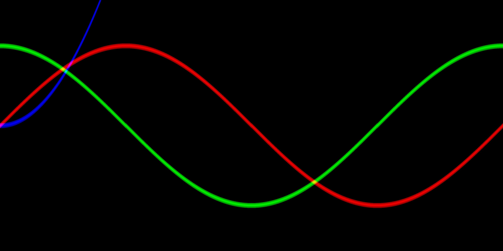

# 作业1

## 1. 绘制[0,2pi]上y1=sinx,y2=cosx,y3=x^2曲线在同一张图片中

所用语言：python3

所用库：PIL，numpy

思路：初始化X数组，分别计算出Y1、Y2、Y3，新建指定大小的二维数组后按比例插值，最后将二维数组转为图片输出。

代码：

```
from PIL import Image
import numpy as np


def generateFigure(shape=(256, 256), thickness=1):
    step = 2 * np.pi / shape[0]
    X = np.arange(0, 2 * np.pi + step, step)
    Y1, Y2, Y3 = np.sin(X), np.cos(X), X ** 2
    MAX = shape[1] // 2
    img = np.zeros((shape[1], shape[0], 3), dtype=np.uint8)
    for i in range(shape[0]):
        for t in range(-thickness // 2, thickness // 2, 1):
            y1, y2, y3 = int(Y1[i] / step) + t, int(Y2[i] / step) + t, int(Y3[i] / step) + t
            if np.abs(y1) < MAX:
                img[-y1 + MAX, i, 0] = 255 - np.abs(t) / thickness * 256
            if np.abs(y2) < MAX:
                img[-y2 + MAX, i, 1] = 255 - np.abs(t) / thickness * 256
            if np.abs(y3) < MAX:
                img[-y3 + MAX, i, 2] = 255 - np.abs(t) / thickness * 256
    img = Image.fromarray(img)
    img.show()
    img.save(r"./result/homework1_1.jpg")


if __name__ == "__main__":
    generateFigure(shape=(4096, 2048), thickness=41)
```

结果：



## 2. 不使用for的双线性插值

本人才疏学浅，只能实现普通的双线性插值，详情见[博客](https://github.com/3017218062/Image-Super-Resolution)。