# 作业2


## 1. 均值滤波器

#### 1). 算术均值滤波器

- 算法原理

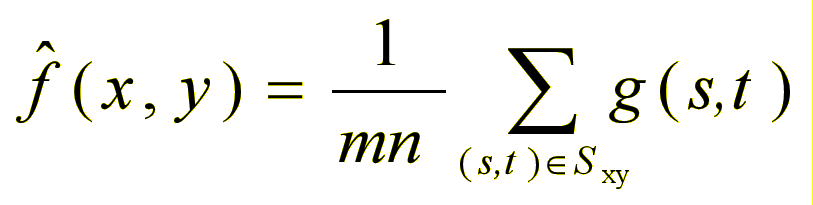

- 算法步骤
    - 选定初始局部窗口大小
    - 对原始图像进行边缘填充
    - 使用处理后的图像进行滑窗
    - 对于局部窗口，求其像素的均值
    - 对每个像素点以局部窗口均值替换

- 算法优化

<a id="算法优化"/>
<p>当前大部分已有代码是通过遍历每一个像素点，分别求局部窗口均值来进行替换，效率极低；</p>
<p>考虑到每个局部滑窗都是由m*n个像素点组成，可以构建m*n个全局滑窗，大小为原始图像大小，使用numpy的高效率计算实现整体运算，一次性算出所有的均值，可以大大简化运算。虽然增加了内存的消耗，但整体效率提高了很多。</p>

- 主要代码

```
def paddingFilling(image, m=3, n=3): # 图像边缘填充函数
    M, N = m // 2, n // 2
    up, down = image[0], image[-1]
    for i in range(M):
        image = np.vstack([up, image, down])
    left, right = image[:, [0]], image[:, [-1]]
    for i in range(N):
        image = np.hstack([left, image, right])
    return image

def imageSpliting(image, m=3, n=3): # 局部窗口分割函数
    height, width = image.shape
    oldImage = paddingFilling(image, m, n)
    oldImages = []
    for i in range(m):
        for j in range(n):
            oldImages.append(oldImage[i:i + height, j:j + width])
    oldImages = np.asarray(oldImages)
    return oldImages

def arithmeticMeanFilter(image, m=3, n=3):  # 均值计算填充函数
    oldImages = imageSpliting(image, m=m, n=n)
    newImage = np.mean(oldImages, axis=0)
    return newImage
```

- 结果展示


#### 2). 几何均值滤波器

- 算法原理

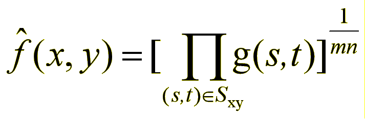

<p>化简：</p>

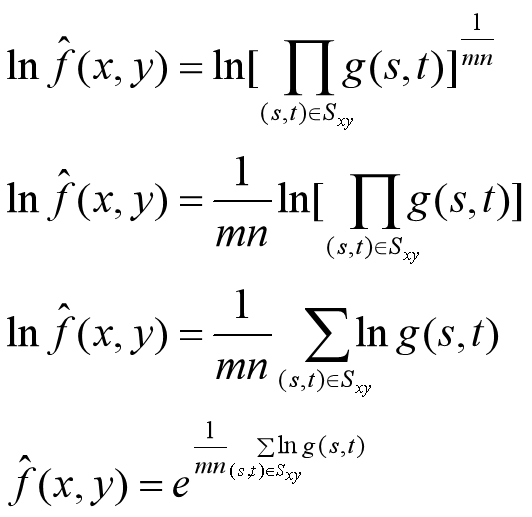

- 算法步骤
    - 选定初始局部窗口大小
    - 对原始图像进行边缘填充
    - 使用处理后的图像进行滑窗
    - 对于所有像素，以其对数替换
    - 对于局部窗口，求其像素的均值
    - 所有像素以局部窗口均值指数替换

- 算法优化

同[算术均值滤波器](#算法优化)

- 主要代码

```
def paddingFilling(image, m=3, n=3): # 图像边缘填充函数
    M, N = m // 2, n // 2
    up, down = image[0], image[-1]
    for i in range(M):
        image = np.vstack([up, image, down])
    left, right = image[:, [0]], image[:, [-1]]
    for i in range(N):
        image = np.hstack([left, image, right])
    return image

def imageSpliting(image, m=3, n=3): # 局部窗口分割函数
    height, width = image.shape
    oldImage = paddingFilling(image, m, n)
    oldImages = []
    for i in range(m):
        for j in range(n):
            oldImages.append(oldImage[i:i + height, j:j + width])
    oldImages = np.asarray(oldImages)
    return oldImages

def geometricMeanFilter(image, m=3, n=3): # 均值计算填充函数
    oldImages = imageSpliting(np.log(image + 0.000001), m=m, n=n)
    newImage = np.exp(np.mean(oldImages, axis=0))
    return newImage
```

- 结果展示

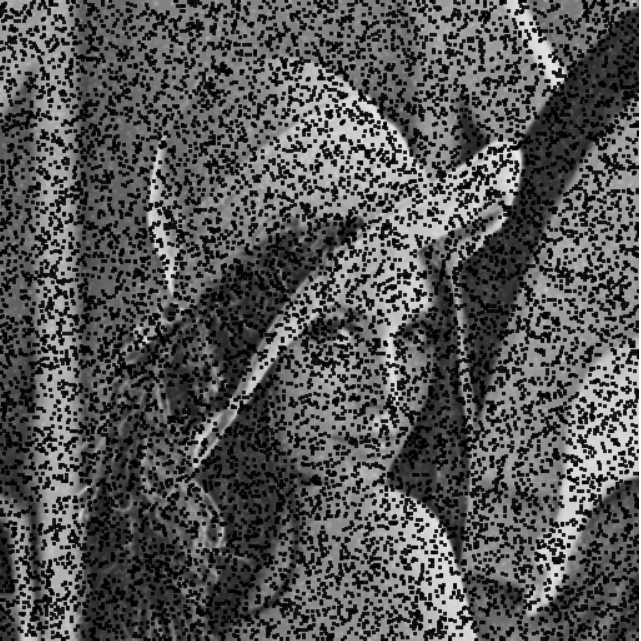

#### 3). 谐波均值滤波器

- 算法原理

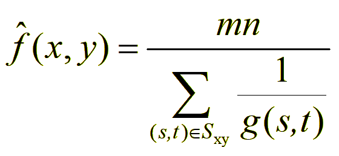

<p>化简：</p>

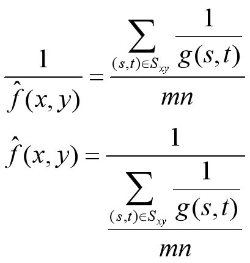

- 算法步骤
    - 选定初始局部窗口大小
    - 对原始图像进行边缘填充
    - 使用处理后的图像进行滑窗
    - 对于所有像素，以其倒数替换
    - 对于局部窗口，求其像素的均值
    - 所有像素以局部窗口均值倒数替换

- 算法优化

同[算术均值滤波器](#算法优化)

- 主要代码

```
def paddingFilling(image, m=3, n=3): # 图像边缘填充函数
    M, N = m // 2, n // 2
    up, down = image[0], image[-1]
    for i in range(M):
        image = np.vstack([up, image, down])
    left, right = image[:, [0]], image[:, [-1]]
    for i in range(N):
        image = np.hstack([left, image, right])
    return image

def imageSpliting(image, m=3, n=3): # 局部窗口分割函数
    height, width = image.shape
    oldImage = paddingFilling(image, m, n)
    oldImages = []
    for i in range(m):
        for j in range(n):
            oldImages.append(oldImage[i:i + height, j:j + width])
    oldImages = np.asarray(oldImages)
    return oldImages

def harmonicMeanFilter(image, m=3, n=3): # 均值计算填充函数
    oldImages = imageSpliting(1 / (image + 0.000001), m=m, n=n)
    newImage = (1 / np.mean(oldImages, axis=0))
    return newImage
```

- 结果展示


#### 4). 逆谐波均值滤波器

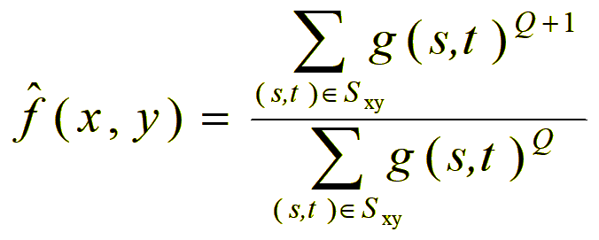

- 算法步骤
    - 选定初始局部窗口大小m*n和Q
    - 对原始图像按照m*n进行边缘填充
    - 使用填充处理后的图像进行滑窗操作
    - 对局部窗口的Q次方和Q+1次方进行求和
    - 所有像素以局部窗口Q+1与Q两和之商替换

- 算法优化

同[算术均值滤波器](#算法优化)

- 主要代码

```
def paddingFilling(image, m=3, n=3): # 图像边缘填充函数
    M, N = m // 2, n // 2
    up, down = image[0], image[-1]
    for i in range(M):
        image = np.vstack([up, image, down])
    left, right = image[:, [0]], image[:, [-1]]
    for i in range(N):
        image = np.hstack([left, image, right])
    return image

def imageSpliting(image, m=3, n=3): # 局部窗口分割函数
    height, width = image.shape
    oldImage = paddingFilling(image, m, n)
    oldImages = []
    for i in range(m):
        for j in range(n):
            oldImages.append(oldImage[i:i + height, j:j + width])
    oldImages = np.asarray(oldImages)
    return oldImages

def inverseHarmonicMeanFilter(image, m=3, n=3, Q=0): # 商值计算填充函数
    oldImages = imageSpliting(image, m=m, n=n)
    if Q < -1:
        return np.sum(1 / (oldImages ** np.abs(Q + 1) + 0.000001), axis=0) / np.sum(
            1 / (oldImages ** np.abs(Q) + 0.000001), axis=0)

    elif Q < 0:
        return np.sum(oldImages ** (Q + 1), axis=0) / np.sum(1 / (oldImages ** np.abs(Q) + 0.000001), axis=0)
    else:
        return np.sum(oldImages ** (Q + 1), axis=0) / np.sum(oldImages ** Q, axis=0)
```

- 结果展示


## 2. 统计排序滤波器

#### 1). 中值滤波器

- 算法原理

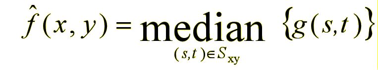

- 算法步骤
    - 选定初始局部窗口大小
    - 对原始图像进行边缘填充
    - 使用处理后的图像进行滑窗
    - 对于局部窗口，求其像素的中值
    - 对所有像素使用局部窗口中值替换

- 算法优化

同[算术均值滤波器](#算法优化)

- 主要代码

```
def paddingFilling(image, m=3, n=3): # 图像边缘填充函数
    M, N = m // 2, n // 2
    up, down = image[0], image[-1]
    for i in range(M):
        image = np.vstack([up, image, down])
    left, right = image[:, [0]], image[:, [-1]]
    for i in range(N):
        image = np.hstack([left, image, right])
    return image

def imageSpliting(image, m=3, n=3): # 局部窗口分割函数
    height, width = image.shape
    oldImage = paddingFilling(image, m, n)
    oldImages = []
    for i in range(m):
        for j in range(n):
            oldImages.append(oldImage[i:i + height, j:j + width])
    oldImages = np.asarray(oldImages)
    return oldImages

def medianFilter(image, m=3, n=3): #中值计算填充函数
    oldImages = imageSpliting(image, m=m, n=n)
    newImage = np.median(oldImages, axis=0)
    return newImage
```

- 结果展示


#### 2). 最大值滤波器

- 算法原理

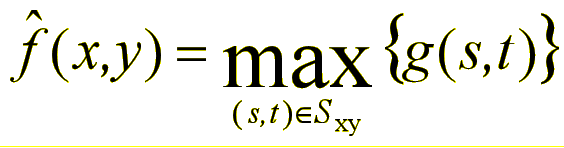

- 算法步骤
    - 选定初始局部窗口大小
    - 对原始图像进行边缘填充
    - 使用处理后的图像进行滑窗
    - 对局部窗口，求其像素最大值
    - 所有像素以局部窗口最大值替换

- 算法优化

同[算术均值滤波器](#算法优化)

- 主要代码

```
def paddingFilling(image, m=3, n=3): # 图像边缘填充函数
    M, N = m // 2, n // 2
    up, down = image[0], image[-1]
    for i in range(M):
        image = np.vstack([up, image, down])
    left, right = image[:, [0]], image[:, [-1]]
    for i in range(N):
        image = np.hstack([left, image, right])
    return image

def imageSpliting(image, m=3, n=3): # 局部窗口分割函数
    height, width = image.shape
    oldImage = paddingFilling(image, m, n)
    oldImages = []
    for i in range(m):
        for j in range(n):
            oldImages.append(oldImage[i:i + height, j:j + width])
    oldImages = np.asarray(oldImages)
    return oldImages

def maximumFilter(image, m=3, n=3): # 最大值计算填充函数
    oldImages = imageSpliting(image, m=m, n=n)
    newImage = np.max(oldImages, axis=0)
    return newImage
```

- 结果展示

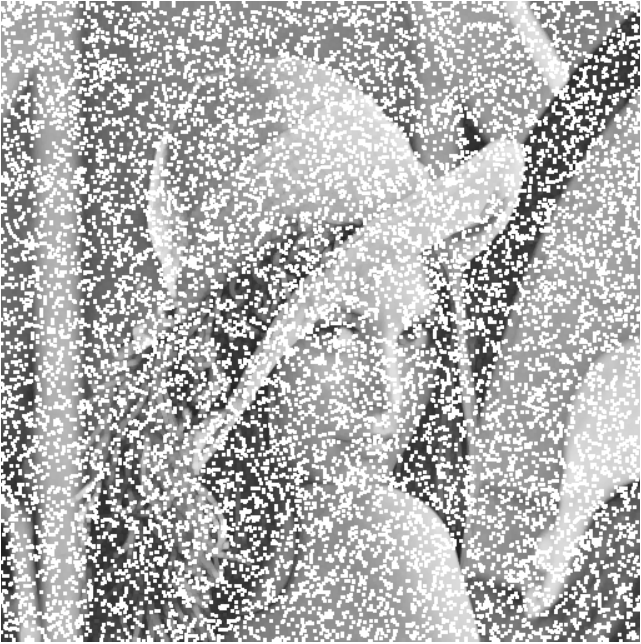

#### 3). 最小值滤波器

- 算法原理

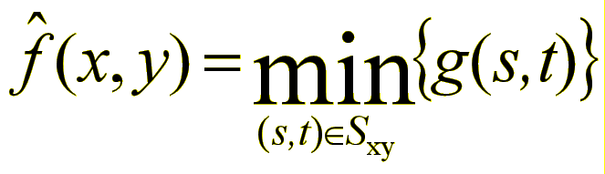

- 算法步骤
    - 选定初始局部窗口大小
    - 对原始图像进行边缘填充
    - 使用处理后的图像进行滑窗
    - 对局部窗口，求其像素最小值
    - 所有像素以局部窗口最小值替换

- 算法优化

同[算术均值滤波器](#算法优化)

- 主要代码

```
def paddingFilling(image, m=3, n=3): # 图像边缘填充函数
    M, N = m // 2, n // 2
    up, down = image[0], image[-1]
    for i in range(M):
        image = np.vstack([up, image, down])
    left, right = image[:, [0]], image[:, [-1]]
    for i in range(N):
        image = np.hstack([left, image, right])
    return image

def imageSpliting(image, m=3, n=3): # 局部窗口分割函数
    height, width = image.shape
    oldImage = paddingFilling(image, m, n)
    oldImages = []
    for i in range(m):
        for j in range(n):
            oldImages.append(oldImage[i:i + height, j:j + width])
    oldImages = np.asarray(oldImages)
    return oldImages

def minimumFilter(image, m=3, n=3): # 最小值计算填充函数
    oldImages = imageSpliting(image, m=m, n=n)
    newImage = np.min(oldImages, axis=0)
    return newImage
```

- 结果展示

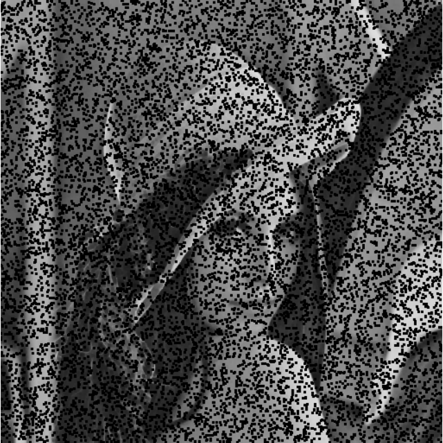

#### 4). 中点滤波器

- 算法原理

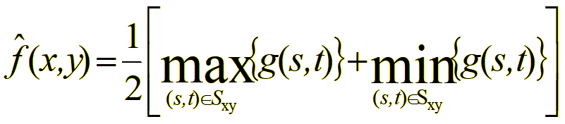

- 算法步骤
    - 选定初始局部窗口大小
    - 对原始图像进行边缘填充
    - 使用处理后的图像进行滑窗
    - 对局部窗口，求其像素两最值
    - 所有像素以局部窗口中点值替换

- 算法优化

同[算术均值滤波器](#算法优化)

- 主要代码

```
def paddingFilling(image, m=3, n=3): # 图像边缘填充函数
    M, N = m // 2, n // 2
    up, down = image[0], image[-1]
    for i in range(M):
        image = np.vstack([up, image, down])
    left, right = image[:, [0]], image[:, [-1]]
    for i in range(N):
        image = np.hstack([left, image, right])
    return image

def imageSpliting(image, m=3, n=3): # 局部窗口分割函数
    height, width = image.shape
    oldImage = paddingFilling(image, m, n)
    oldImages = []
    for i in range(m):
        for j in range(n):
            oldImages.append(oldImage[i:i + height, j:j + width])
    oldImages = np.asarray(oldImages)
    return oldImages

def medianRangeFilter(image, m=3, n=3): # 中点计算填充函数
    oldImages = imageSpliting(image, m=m, n=n)
    newImage = (np.max(oldImages, axis=0) + np.min(oldImages, axis=0)) / 2
    return newImage
```

- 结果展示

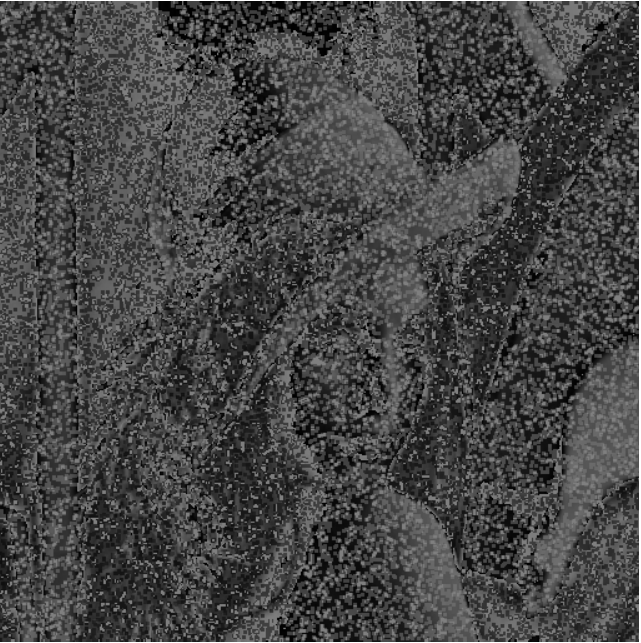

#### 5). 修正阿尔法均值滤波器

- 算法原理

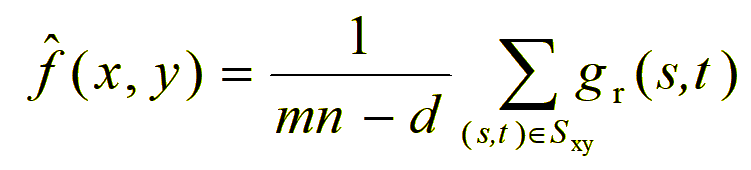

- 算法步骤
    - 选定初始局部窗口大小
    - 对原始图像进行边缘填充
    - 使用处理后的图像进行滑窗
    - 对于局部窗口，移除d个最值
    - 对局部窗口，求其剩余像素均值
    - 对于所有像素以局部窗口均值替换

- 算法优化

同[算术均值滤波器](#算法优化)

- 主要代码

```
def paddingFilling(image, m=3, n=3): # 图像边缘填充函数
    M, N = m // 2, n // 2
    up, down = image[0], image[-1]
    for i in range(M):
        image = np.vstack([up, image, down])
    left, right = image[:, [0]], image[:, [-1]]
    for i in range(N):
        image = np.hstack([left, image, right])
    return image

def imageSpliting(image, m=3, n=3): # 局部窗口分割函数
    height, width = image.shape
    oldImage = paddingFilling(image, m, n)
    oldImages = []
    for i in range(m):
        for j in range(n):
            oldImages.append(oldImage[i:i + height, j:j + width])
    oldImages = np.asarray(oldImages)
    return oldImages

def modifiedAlphaMeanFilter(image, m=3, n=3, d=6): #均值计算填充函数
    d = d // 2
    oldImages = imageSpliting(image, m=m, n=n)
    oldImages = np.sort(oldImages, axis=0)
    newImage = np.mean(oldImages[d:m * n - d], axis=0)
    return newImage
```

- 结果展示


## 3. 自适应滤波器

#### 1). 自适应滤波器

- 算法原理

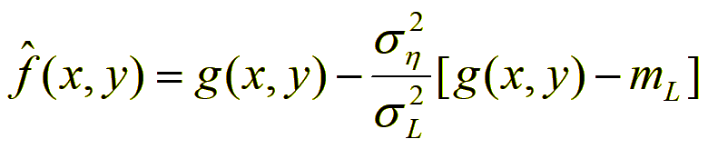

- 算法步骤
    - 计算原始图像的方差
    - 选定初始局部窗口大小
    - 对原始图像进行边缘填充
    - 使用处理后的图像进行滑窗
    - 求局部窗口的局部均值和方差
    - 对于所有像素以公式计算值替换

- 算法优化

同[算术均值滤波器](#算法优化)

- 主要代码

```
def paddingFilling(image, m=3, n=3): # 图像边缘填充函数
    M, N = m // 2, n // 2
    up, down = image[0], image[-1]
    for i in range(M):
        image = np.vstack([up, image, down])
    left, right = image[:, [0]], image[:, [-1]]
    for i in range(N):
        image = np.hstack([left, image, right])
    return image

def imageSpliting(image, m=3, n=3): # 局部窗口分割函数
    height, width = image.shape
    oldImage = paddingFilling(image, m, n)
    oldImages = []
    for i in range(m):
        for j in range(n):
            oldImages.append(oldImage[i:i + height, j:j + width])
    oldImages = np.asarray(oldImages)
    return oldImages

def adaptiveFilter(image, m=3, n=3): # 方差均值计算函数
    globalVar = np.var(image)
    oldImages = imageSpliting(image, m=m, n=n)
    localMean = np.mean(oldImages, axis=0)
    localVar = np.var(oldImages, axis=0) + 0.000001
    newImage = image - (globalVar / localVar) * (image - localMean)
    return newImage
```

- 结果展示

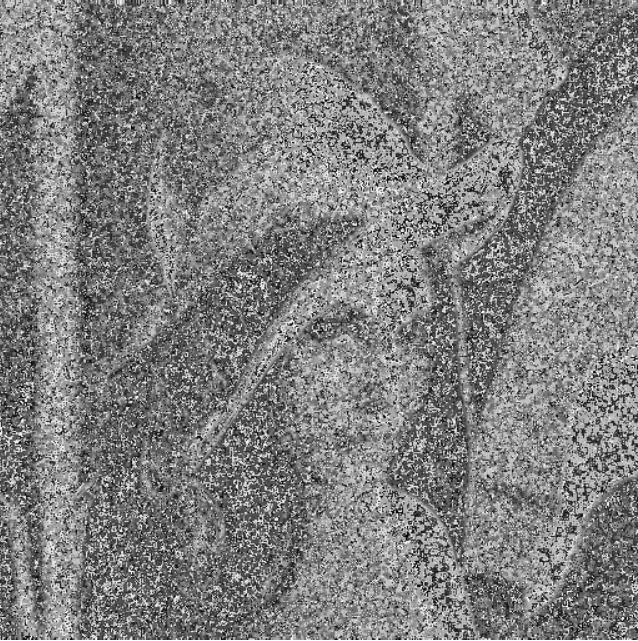


#### 2). 自适应中值滤波器

- 算法原理

- 算法步骤

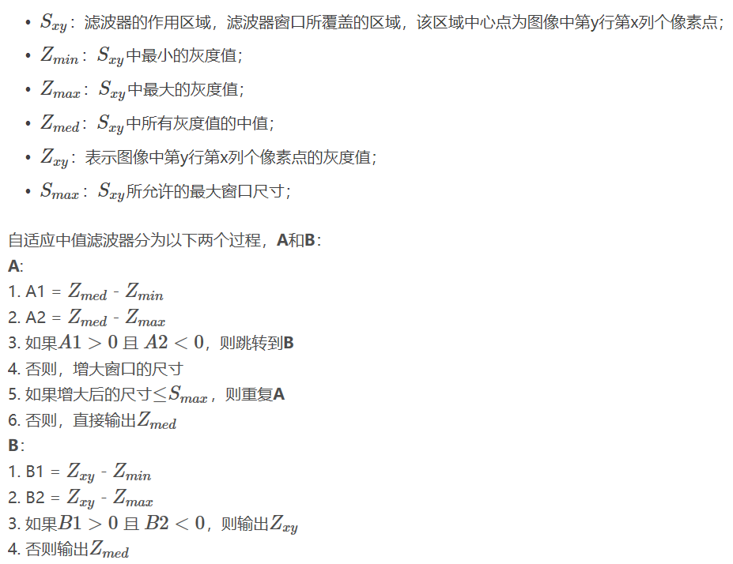

- 算法优化

<p>算法本身无法进行优化了；</p>
<p>在程序中减少拷贝操作，避免重复操作（比如排序后取值）。</p>

- 主要代码

```
def adaptiveMedianFilter(image, Smax=7):
    height, width = image.shape
    newImage = image.copy()
    for i in range(height):
        for j in range(width):
            size = 3
            z = image[i][j]
            while (size <= Smax):
                s = size // 2
                tmp = image[max(0, i - s):i + s + 1, max(0, j - s):j + s + 1].reshape(-1)
                tmp.sort()
                zmin, zmax, zmed = tmp[0], tmp[-1], tmp[tmp.shape[0] // 2]
                if zmin < zmed < zmax:
                    if z == zmin or z == zmax:
                        newImage[i][j] = zmed
                    break
                else:
                    size += 2
    return newImage
```

- 结果展示


