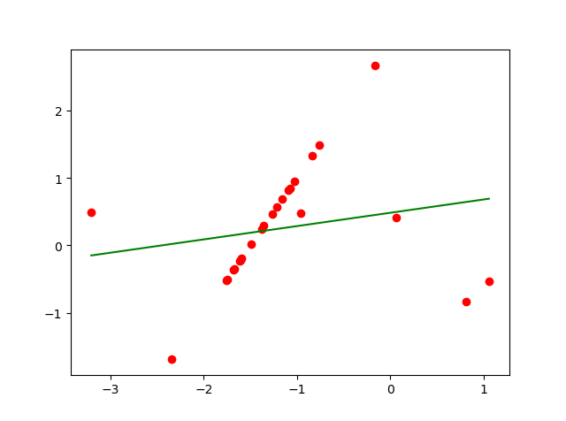
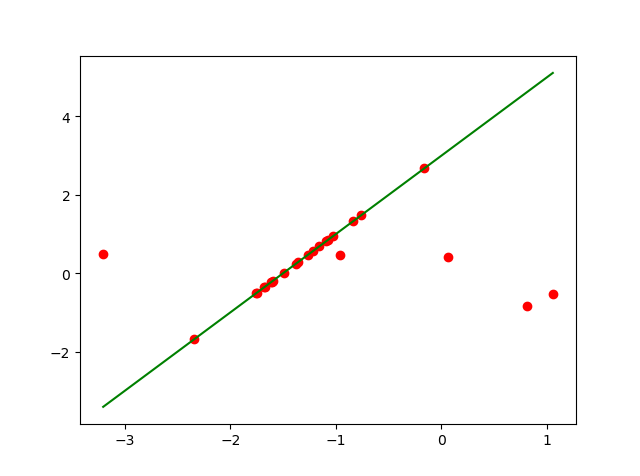
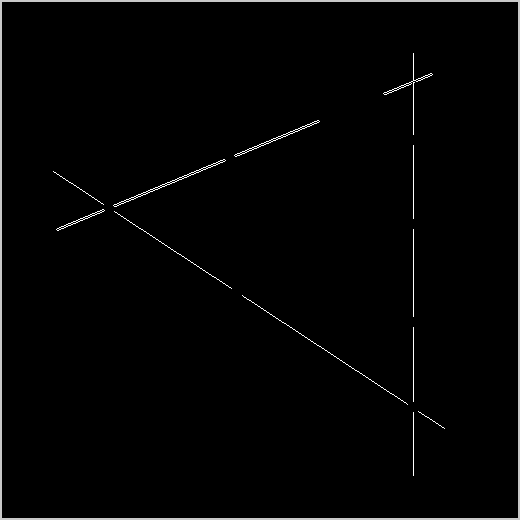

# 作业3

## 1. 对LoG的数学形式进行数学推导

## 2. 实现最小二乘法、RANSAC法、霍夫变换法

- 最小二乘法

    - 对斜率存在的函数
    
    可以使用标准方程求解：
    
    
    
    - 对斜率不存在的函数
    
    使用梯度下降法求解。
    
    
    
- RANSAC法
    
    - 设定迭代次数i，单个点误差为t，最优总误差为loss，最优参数为args，随机选取数量为n，模型最小样本数为d
    
    - 迭代更新参数：
    
        - 从样本总体中随机选取n个样本，进行拟合得到模型
        
        - 清空模型中的样本，然后遍历所有样本，满足模型误差的加入到模型中
        
        - 模型中的样本量满足d时，使用它们再次拟合得到新模型
        
        - 如果新模型的总误差小于loss，更新loss和args
        
    - 得到最优的模型
    
- 霍夫变换法

    - 选取极坐标系，创建数组用于保存参数
    
    - 遍历所有样本点对：
    
        - 计算参数
        
        - 将参数加入数组
        
    - 对数组进行计数，得到频率最高的参数为最优参数

#### 1). 对于直线方程y=ax+b，生成一系列纵坐标符合高斯分布的点，再人工加入一系列的outlier，使用上述三种方法拟合一条直线

设直线为y=2x+3：

- 最小二乘法

- RANSAC法

- 霍夫变换法

#### 2). 找到一幅实际图像（较简单的），使用一阶导数或二阶导数找出边缘点，使用上述三种方法，找到其中的直线

为了明显地看出效果，使用一些简单的图：

- 使用LoG算子进行检测边缘点

- 使用最小二乘法检测边缘线

- 使用RANSAC法检测边缘线

- 使用霍夫变换法检测边缘线