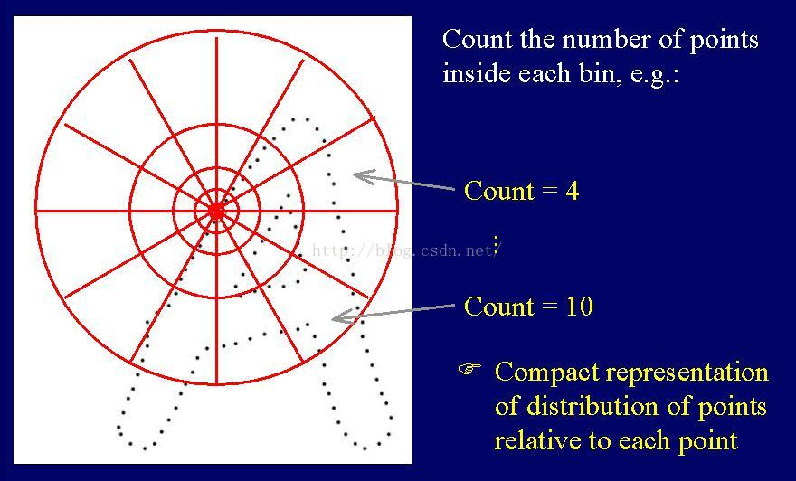
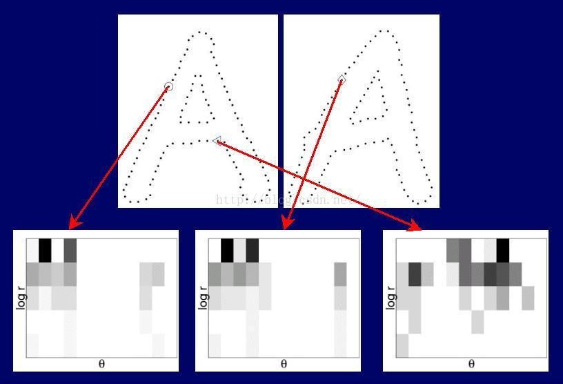
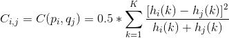
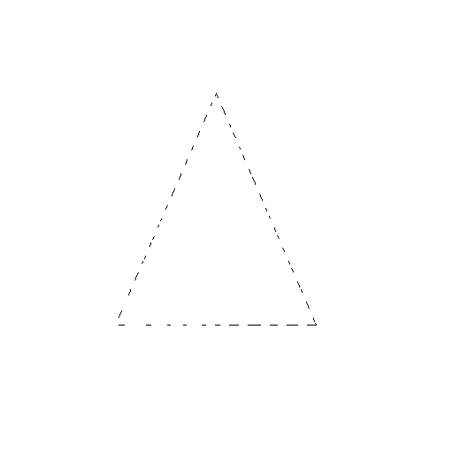
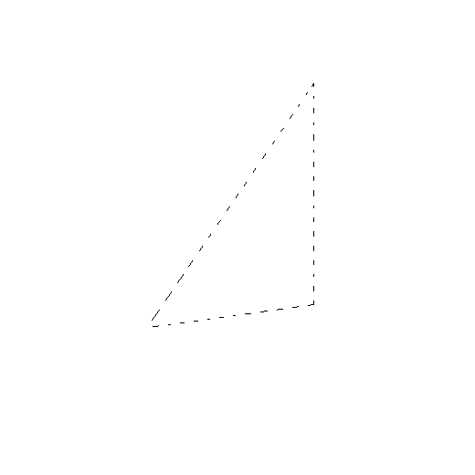
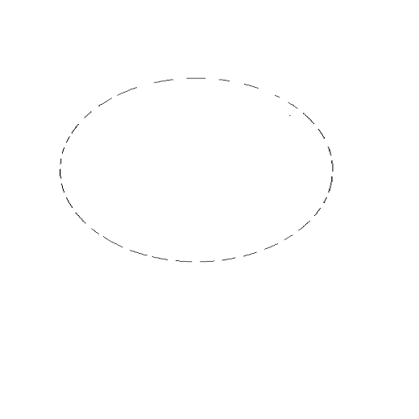

# 作业4

## 1. 实现Shape Context

- [算法原理](https://blog.csdn.net/u012507022/article/details/52437149)

    - 获取图像边缘轮廓
    
        - 对于给定的一个形状，通过边缘检测算子(如:log算子)获取轮廓边缘，对轮廓边缘采样得到一组离散的点集P={p1，p2，p3，..pn}。

    - 计算形状上下文
        
        - 以其中任意一点pi为参考点，在pi为圆心、R为半径的局域内按对数距离间隔建立N个同心圆。
        
        - 将此区域沿圆周方向M等分，形成如图所示的靶状模板。
        
        
    
        - 点pi到其它各点的向量相对位置简化为模板上各扇区内的点分布数。这些点的统计分布直方图hi(k)，称为点pi的形状上下文，其计算公式为：

        

        - 其中，k={1，2，……，K}，K=M*N；
        
        - 采用对数距离分割可以使形状上下文描述子对邻近的采样点比远离点更敏感，能强化局部特征。轮廓不同点处的形状上下文是不同的，但相似轮廓的对应点处趋于有相似的形状上下文，如图:
        
        
        
        - 对于整个点集P ，分别以其n个点 p1，p2，p3，..pn作参考点，依次计算与剩下的n-1个点构成的形状直方图，最终得到 n个形状直方图。以n*(n-1)大小的矩阵存储。这样，对于任一目标，可用n*(n-1)大小的矩阵表示其形状信息，n*(n-1)大小的矩阵就是点集P的形状上下文，它描述了整个轮廓形状的特征。采样点越多，形状表达也越精细，计算量也会成倍加大。
    
    - 计算代价矩阵cost
        
        - 计算一个目标的形状直方图与另一目标的形状直方图之间的匹配代价，代价函数如下：
        
        
        
        - 其中,hi(k)为目标P的点pi的形状直方图；hj(k)为目标Q的点qi的形状直方图。按照公式，即可得到两个目标之间的代价矩阵C，大小为n*n。
    
    - 然后,基于计算得到的代价矩阵C，进行点的匹配操作，使上述公式获得最小值。经分析，上述点的匹配问题即为典型的双向图的匹配问题。利用匈牙利算法，该问题得到解决。
    
- 主要代码

```
getEdge(): 使用LOG算子获取边缘点，并采样。
getShapeContext(): 计算形状上下文。
getCost()：计算cost矩阵。
KM(): 改进后的匈牙利算法。
```

- 结果展示

输入图片1、2：





输出相似度：1933.9686207583175

输入图片1、3：




输出相似度：2173.254687737986

输入图片2、3：


输出相似度：2538.1274688761764
